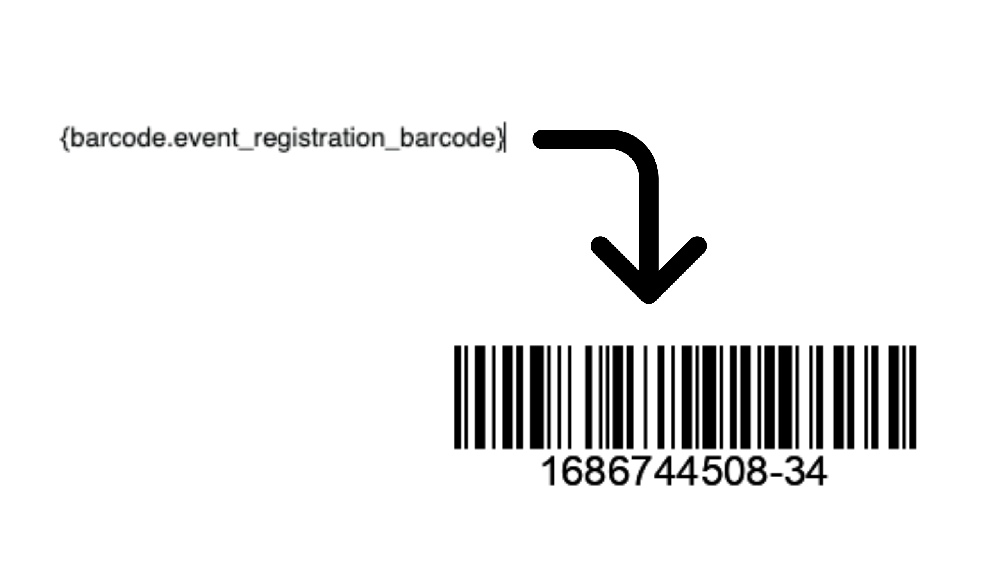

# com.osseed.civibarcode



The extension is licensed under [AGPL-3.0](LICENSE.txt).

## Requirements

* PHP v7.4+
* CiviCRM (v5.x+)

## Introduction

The extension creates a token `{barcode.event_registration_barcode}` that can be used in message templates of Event Registration mail .

## Installation (Web UI)

Learn more about installing CiviCRM extensions in the [CiviCRM Sysadmin Guide](https://docs.civicrm.org/sysadmin/en/latest/customize/extensions/).

## Installation (CLI, Zip)

Sysadmins and developers may download the `.zip` file for this extension and
install it with the command-line tool [cv](https://github.com/civicrm/cv).

```bash
cd <extension-dir>
cv dl com.osseed.civibarcode@https://github.com/osseed/com.osseed.civibarcode/archive/master.zip
```

## Installation (CLI, Git)

Sysadmins and developers may clone the [Git](https://en.wikipedia.org/wiki/Git) repo for this extension and
install it with the command-line tool [cv](https://github.com/civicrm/cv).

```bash
git clone https://github.com/osseed/com.osseed.civibarcode.git
cv en civibarcode
```

## Usage

Add the token `Event Registration Barcode` to event registration message template which will get replace with barcode generated with currentdate and `participant_id` in confirmation email.

## Note

The `code 128` type is used to create the Barcode.(The library used is [barcodebakery](https://www.barcodebakery.com)).
